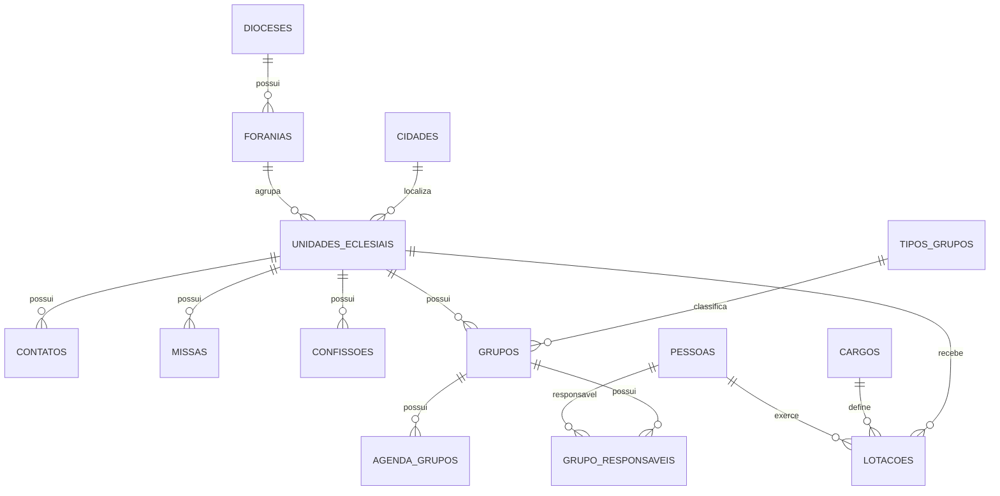

# Projeto: Sistema de Gestão Diocesana (Supabase + HTML)

## 1. Visão Geral

Sistema para gestão da estrutura da Diocese:

- Diocese
- Foranias
- Paróquias
- Comunidades
- Capelas
- Basílicas
- Santuários
- Conventos
- Pessoas
- Cargos
- Missas
- Confissões
- Pastorais
- Movimentos
- Eventos
- Contatos

Plataforma alvo:

- Banco: PostgreSQL (Supabase)
- API: Supabase REST / SDK
- Frontend: HTML + CSS + JavaScript
- Futuro: Power BI, Power Apps ou Aplicativo Mobile

---

# 2. Objetivos

## Objetivos Funcionais

- Cadastro da estrutura da Diocese.
- Consulta pública de paróquias.
- Consulta de comunidades.
- Consulta de missas.
- Consulta de confissões.
- Consulta de pastorais.
- Consulta de movimentos.
- Consulta de coordenadores.
- Consulta por cidade.
- Consulta por forania.
- Agenda pastoral.

## Objetivos Técnicos

- Evitar redundância.
- Permitir histórico de cargos.
- Manter escalabilidade.
- Suportar milhares de registros.
- Permitir API pública.

---

# 3. Padrões de Nomenclatura

## Tabelas

- snake_case
- plural

Exemplo:

- cidades
- foranias
- unidades_eclesiais

## Colunas

- snake_case
- sem acentos

Exemplo:

- data_fundacao
- horario_atendimento

## Chaves

PK

- id_tabela

FK

- id_entidade_referenciada

Exemplo:

- id_forania
- id_cidade

---

# 4. Modelo Conceitual

Diocese
└── Forania
    └── Unidade Eclesial
        ├── Paróquia
        ├── Comunidade
        ├── Capela
        ├── Basílica
        ├── Santuário
        └── Convento

Cada unidade pode possuir:

- Pessoas
- Contatos
- Missas
- Confissões
- Pastorais
- Movimentos
- Agenda

---

# 5. MER (Mermaid)



---

# 6. Modelo Lógico

## dioceses
- id_diocese
- nome

## cidades
- id_cidade
- nome
- estado

## foranias
- id_forania
- id_diocese
- nome
- data_criacao

## unidades_eclesiais
- id_unidade
- id_forania
- id_cidade
- id_unidade_pai
- tipo
- nome
- padroeiro
- link_oficial
- descricao_historica
- endereco
- numero
- bairro
- cep
- horario_atendimento
- data_fundacao
- ativo

## pessoas
- id_pessoa
- nome
- titulo
- observacao

## cargos
- id_cargo
- nome

## lotacoes
- id_lotacao
- id_pessoa
- id_cargo
- id_unidade
- data_inicio
- data_fim
- ativo

## contatos
- id_contato
- id_unidade
- tipo
- valor

## missas
- id_missa
- id_unidade
- dia_semana
- horario
- celebrante

## confissoes
- id_confissao
- id_unidade
- dia_semana
- horario_inicio
- horario_fim

## tipos_grupos
- id_tipo_grupo
- nome

## grupos
- id_grupo
- id_unidade
- id_tipo_grupo
- nome
- descricao

## grupo_responsaveis
- id
- id_grupo
- id_pessoa
- funcao

## agenda_grupos
- id_agenda
- id_grupo
- dia_semana
- horario
- local

---

# 7. SQL Base (DDL)

```sql
-- Diocese
CREATE TABLE dioceses (
 id_diocese BIGSERIAL PRIMARY KEY,
 nome VARCHAR(200) NOT NULL
);

-- Cidade
CREATE TABLE cidades (
 id_cidade BIGSERIAL PRIMARY KEY,
 nome VARCHAR(100) NOT NULL,
 estado CHAR(2) NOT NULL DEFAULT 'SP'
);

-- Forania
CREATE TABLE foranias (
 id_forania BIGSERIAL PRIMARY KEY,
 id_diocese BIGINT NOT NULL REFERENCES dioceses(id_diocese),
 nome VARCHAR(200) NOT NULL,
 data_criacao DATE
);

-- Unidade Eclesial
CREATE TABLE unidades_eclesiais (
 id_unidade BIGSERIAL PRIMARY KEY,
 id_forania BIGINT REFERENCES foranias(id_forania),
 id_cidade BIGINT REFERENCES cidades(id_cidade),
 id_unidade_pai BIGINT REFERENCES unidades_eclesiais(id_unidade),
 tipo VARCHAR(50) NOT NULL,
 nome VARCHAR(255) NOT NULL,
 padroeiro VARCHAR(255),
 link_oficial VARCHAR(500),
 descricao_historica TEXT,
 endereco VARCHAR(255),
 numero VARCHAR(30),
 bairro VARCHAR(150),
 cep VARCHAR(20),
 horario_atendimento TEXT,
 data_fundacao DATE,
 ativo BOOLEAN DEFAULT TRUE
);

CREATE TABLE pessoas (
 id_pessoa BIGSERIAL PRIMARY KEY,
 nome VARCHAR(255) NOT NULL,
 titulo VARCHAR(100),
 observacao TEXT
);

CREATE TABLE cargos (
 id_cargo BIGSERIAL PRIMARY KEY,
 nome VARCHAR(100) UNIQUE NOT NULL
);

CREATE TABLE lotacoes (
 id_lotacao BIGSERIAL PRIMARY KEY,
 id_pessoa BIGINT NOT NULL REFERENCES pessoas(id_pessoa),
 id_cargo BIGINT NOT NULL REFERENCES cargos(id_cargo),
 id_unidade BIGINT NOT NULL REFERENCES unidades_eclesiais(id_unidade),
 data_inicio DATE,
 data_fim DATE,
 ativo BOOLEAN DEFAULT TRUE
);

CREATE TABLE contatos (
 id_contato BIGSERIAL PRIMARY KEY,
 id_unidade BIGINT NOT NULL REFERENCES unidades_eclesiais(id_unidade),
 tipo VARCHAR(50) NOT NULL,
 valor VARCHAR(255) NOT NULL
);

CREATE TABLE missas (
 id_missa BIGSERIAL PRIMARY KEY,
 id_unidade BIGINT NOT NULL REFERENCES unidades_eclesiais(id_unidade),
 dia_semana SMALLINT NOT NULL,
 horario TIME NOT NULL,
 celebrante VARCHAR(255),
 observacoes TEXT
);

CREATE TABLE confissoes (
 id_confissao BIGSERIAL PRIMARY KEY,
 id_unidade BIGINT NOT NULL REFERENCES unidades_eclesiais(id_unidade),
 dia_semana SMALLINT,
 horario_inicio TIME,
 horario_fim TIME,
 observacoes TEXT
);

CREATE TABLE tipos_grupos (
 id_tipo_grupo BIGSERIAL PRIMARY KEY,
 nome VARCHAR(150) NOT NULL
);

CREATE TABLE grupos (
 id_grupo BIGSERIAL PRIMARY KEY,
 id_unidade BIGINT NOT NULL REFERENCES unidades_eclesiais(id_unidade),
 id_tipo_grupo BIGINT NOT NULL REFERENCES tipos_grupos(id_tipo_grupo),
 nome VARCHAR(255) NOT NULL,
 descricao TEXT,
 ativo BOOLEAN DEFAULT TRUE
);

CREATE TABLE grupo_responsaveis (
 id BIGSERIAL PRIMARY KEY,
 id_grupo BIGINT NOT NULL REFERENCES grupos(id_grupo),
 id_pessoa BIGINT NOT NULL REFERENCES pessoas(id_pessoa),
 funcao VARCHAR(100)
);

CREATE TABLE agenda_grupos (
 id_agenda BIGSERIAL PRIMARY KEY,
 id_grupo BIGINT NOT NULL REFERENCES grupos(id_grupo),
 dia_semana SMALLINT,
 horario TIME,
 local VARCHAR(255),
 observacoes TEXT
);
```

---

# 8. Índices Recomendados

```sql
CREATE INDEX idx_unidade_nome ON unidades_eclesiais(nome);
CREATE INDEX idx_unidade_tipo ON unidades_eclesiais(tipo);
CREATE INDEX idx_unidade_forania ON unidades_eclesiais(id_forania);
CREATE INDEX idx_unidade_cidade ON unidades_eclesiais(id_cidade);

CREATE INDEX idx_lotacao_unidade ON lotacoes(id_unidade);
CREATE INDEX idx_lotacao_pessoa ON lotacoes(id_pessoa);
CREATE INDEX idx_lotacao_cargo ON lotacoes(id_cargo);

CREATE INDEX idx_missas_unidade ON missas(id_unidade);
CREATE INDEX idx_grupos_unidade ON grupos(id_unidade);
```

---

# 9. Estratégia de Ingestão

## Fonte

Site da Diocese.

## Camadas

Raw
→ HTML original

Silver
→ Dados tratados

Gold
→ Banco Supabase

## Processo

1. Coleta HTML.
2. Extração.
3. Normalização.
4. Deduplicação.
5. Carga no PostgreSQL.

---

# 10. RLS Supabase

Público:

- SELECT

Administradores:

- INSERT
- UPDATE
- DELETE

Utilizar tabela de perfis e roles.

---

# 11. Roadmap

## Fase 1

- Modelagem
- Supabase
- Cadastro de Paróquias
- Cadastro de Comunidades

## Fase 2

- Missas
- Confissões
- Contatos
- Busca

## Fase 3

- Pastorais
- Movimentos
- Agenda pastoral

## Fase 4

- Painel Administrativo
- Upload de imagens
- Integração WhatsApp

## Fase 5

- App Mobile
- Geolocalização
- Notificações

## Fase 6

- Power BI
- Indicadores Pastorais
- Dashboard Diocesano

---

# 12. Dados Mestres Iniciais

Cargos:

- Pároco
- Reitor
- Vigário Paroquial
- Administrador Paroquial
- Diácono
- Colaborador Paroquial
- Guardião
- Responsável
- Atendente
- Coordenador de Comunidade
- Vigário Forâneo

Tipos de Grupo:

- Terço dos Homens
- Grupo de Oração
- RCC
- Pastoral Familiar
- Pastoral da Criança
- Catequese
- Liturgia
- Vicentinos
- ECC
- EAC
